

#### User manual
### Przedstawienie wyboru funkcjonalności dla poszczególnych użytkowników, w postaci UML
##### Etap 1 Faza 2

<b>Autorzy:</b>
Wojciech Maj
Piotr Łach

<b> Streszczenie</b>
Przedstawiony dokument przedstawia przypadki użycia dla poszczególnych typów użytkownika, wybór funkcjonalności jest przedstawiony w formie UML(wizualnej), a także w opcji wyszczególnionej.
Aplikacja zakłada trzy typy użytkowników, z poszczególnymi funkcjonalnościami:

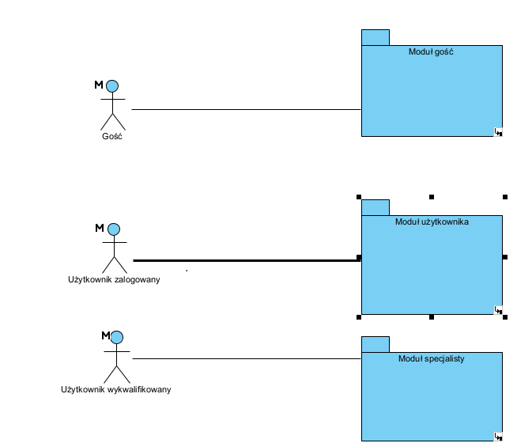

* #### Gość 

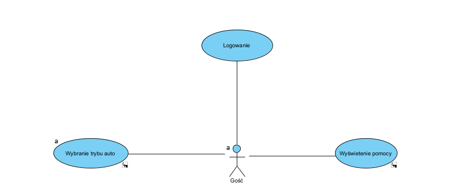

Logowanie - opcja ta pozwala na zalogowanie się na pozostałe typy użytkowników. 
Pomiar - dostęp do pomiarów trybu AUTO. 
Dodatkowo istnieje możliwość wyświetlenie pomocy.
 
 
 

* #### Użytkownik

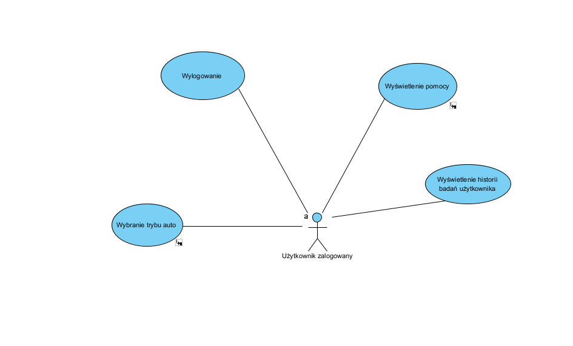

Pomiar - dostęp do pomiarów trybu AUTO 
Przeglądanie swojej historii pomiarowej badań 
Wyświetlenie pomocy
Wylogowanie się  

 
 
 

* #### Użytkownik wykwalifikowany

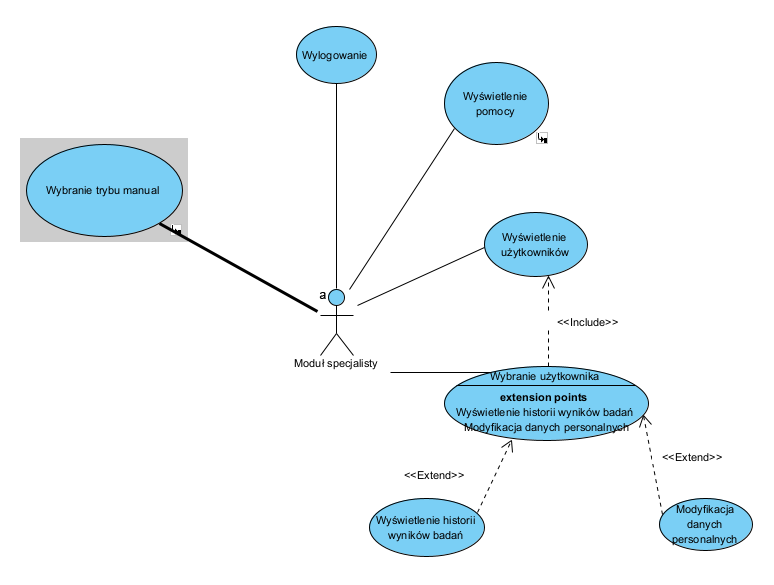

Pomiar - dostęp do pomiarów trybu AUTO i MANUAL 
Przeglądanie historii pomiarowej badań wszystkich podlegających użytkowników/pacjentów
Zarządzenie/Modyfikacja danych personalnych podlegających użytkowników 
Wyświetlenie pomocy
Wylogowanie się  

#### Pomoc
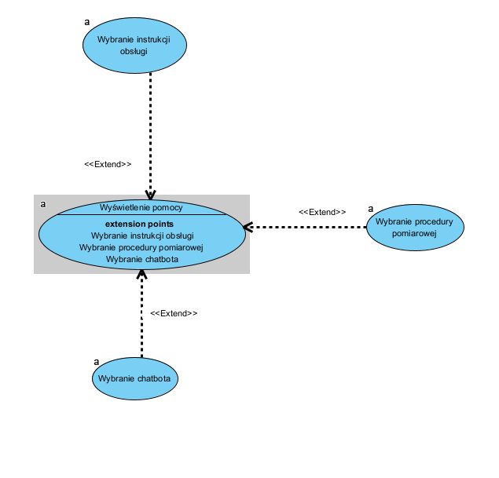

#### Tryb pomiarowy AUTO

Ten tryb charakteryzuje się:
1. Każdy użytkownik aplikacji ma do niego dostęp.
2. Pozwala na analizę jednej osoby jednocześnie
3. Zezwala na prowadzenia badań po przez maksymalnie przez dwie taśmy.
4. Dane uzyskane przez prowadzoną analizę będą zapisane do historii wyników badań dla danego użytkownika

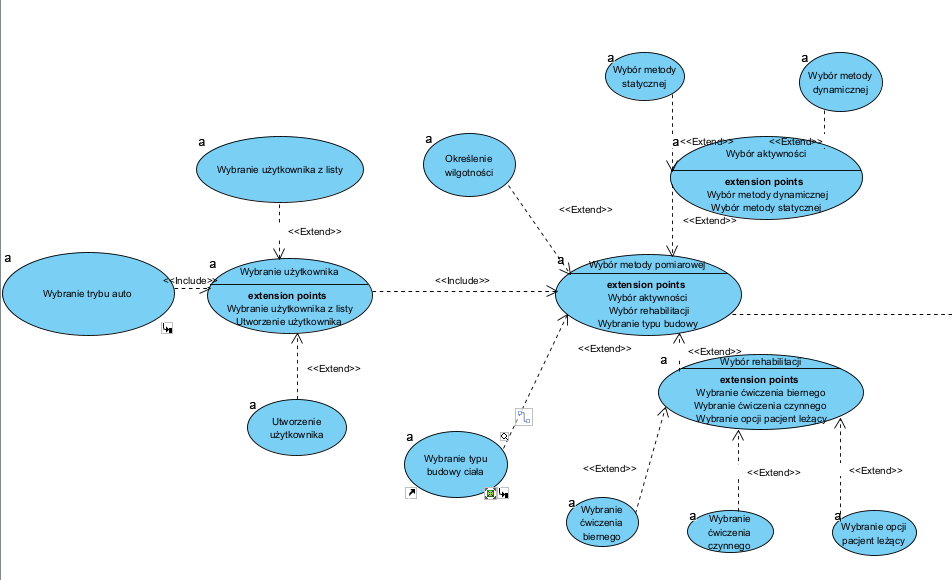
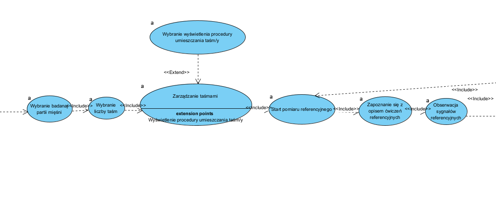
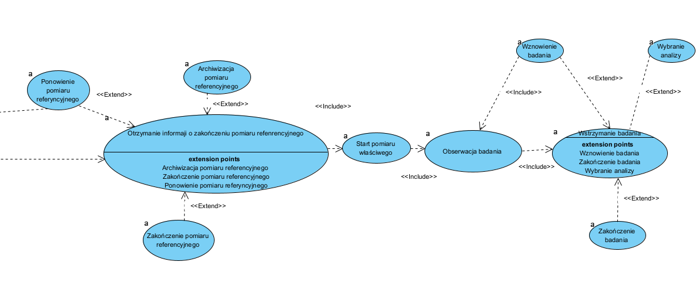

#### Tryb pomiarowy MANUAL

Ten tryb charakteryzuje się:
1. Tylko użytkownik wykwalifikowany ma do niego dostęp do tego trybu.
2. Pozwala na analizę kilku osób jednocześnie
3. Zezwala na prowadzenia badań po przez kilka taśm pomiarowych dla każdej osoby z osobna.
4. Dane uzyskane przez prowadzoną analizę będą zapisane do historii wyników badań dla danego użytkownika

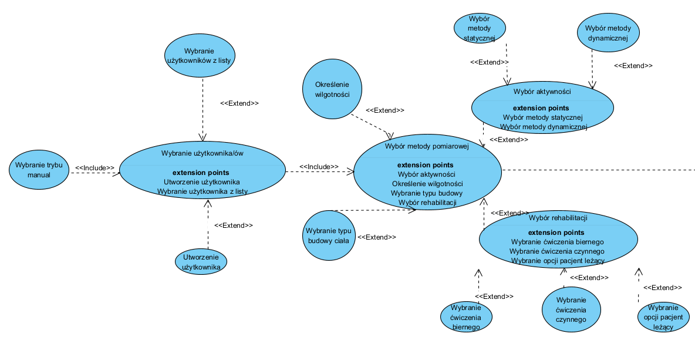
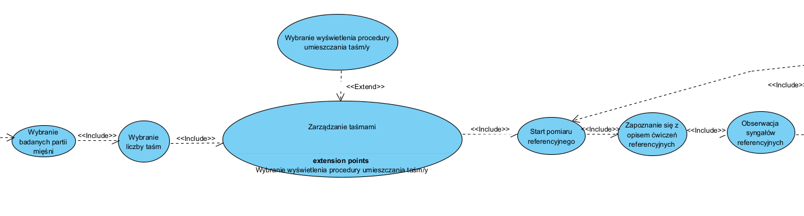
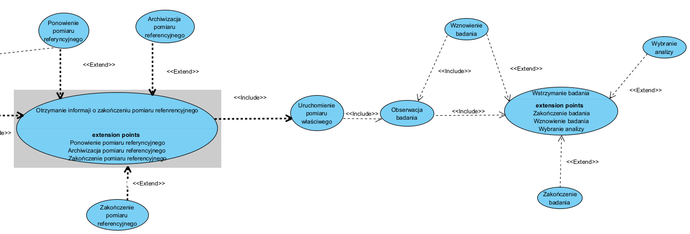

