## Raport Etapu 2
#### Niniejszy raport dotyczy podsumowania zrealizowanych zadań z Etapu 2 (Trello-Aplikacja-Etap 2)
> #### Wojciech Maj, Piotr Łach

#### Założenia

Głównych założeń aplikacji jest prowadzenie akwizycji danych podczas sesji treningowych lub rehabilitacyjnych. Dodatkowo aplikacja ma zadanie umożliwić wyświetlenie historii pomiarowej użytkownika lub użytkowników (w przypadku użytkownika zaawansowanego).

#### Realizacja

Praca nad stworzeniem aplikacji jest podzielona na 4 etapy. 
Etap 2 miał zostać ukończony do 17 stycznia ( Znaczne przesunięcie), który składa się z następujących zadań:
*  Obsługa bazy danych: dane pomiarowe
*  Widoki trybu Auto
*  Widoki trybu Manual
*  Widoki pomocy
*  Implementacja modułu pomiarowego
*  Implementacja modułu pomocy

Wszytskie zadania udało się zrealizować

#### Problemy

Ten etap był bardzo obfity w pojawianie się problemów, począwszy od tego że długi czas oczekiwania na otrzymanie stacji bazowej i modułu akwizycji danych.
Dodatkowo pojawił się znaczny problem w doborze biblioteki `Kivy`, która nie dość że mocno dołożyła nam pracy to całkowicie się nie sprawdziła na etapie wizualizacji sygnału. 
Dlatego ten czas zostal wydłużony o ponową implementację całego widoku z wykorzystaniem innej bibliteki `PyQt6`, gdzie musieliśmy ponownie przeprowadzić etap 1, co skutkowało dodatkowym nakładem pracy.

### GUI trybów pomiarowych

Rozpoczęcei pomiaru dla trybu gość
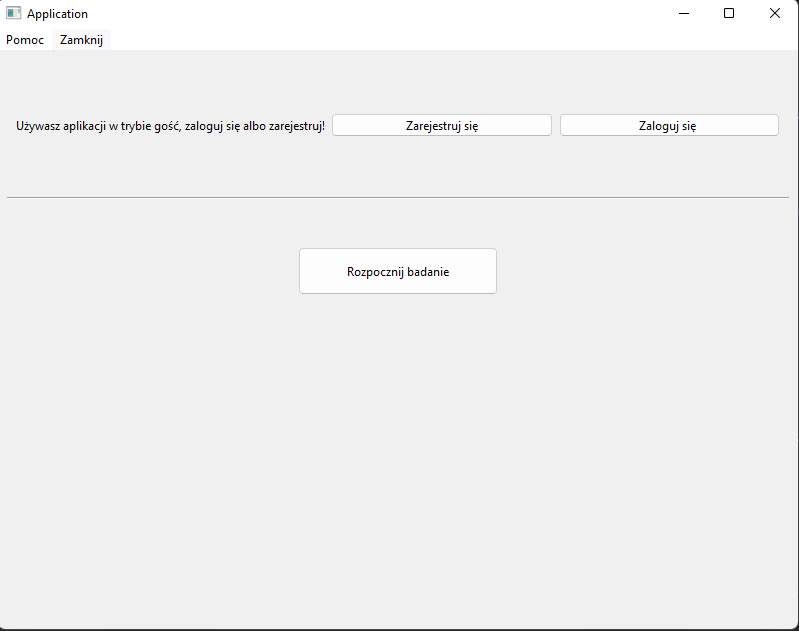

Wybór aktywności
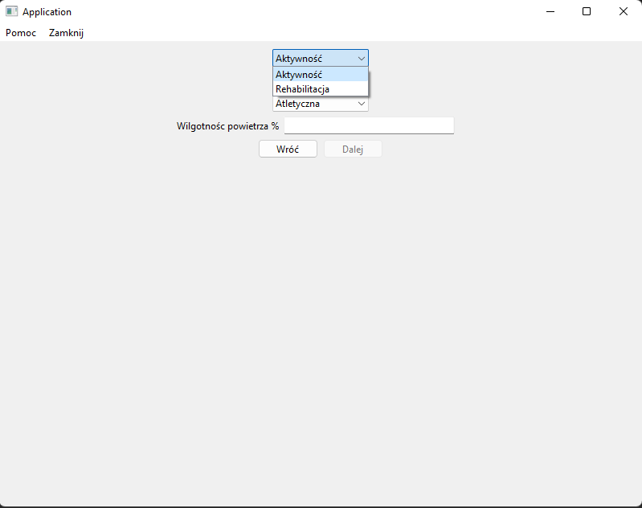
Wybór sylwetki
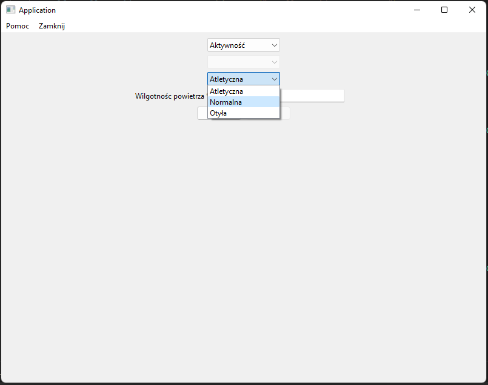

Wybór liczby taśm pomiarowych TRYB AUTO
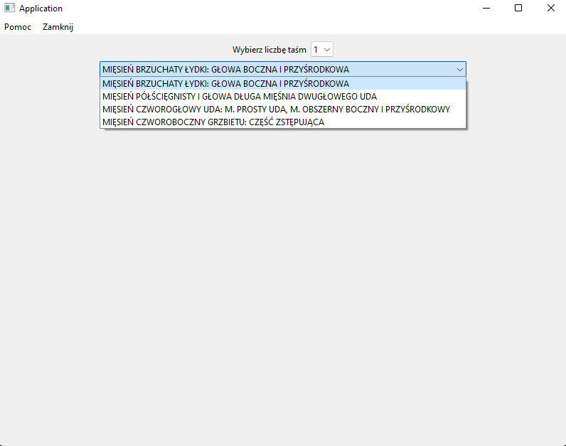
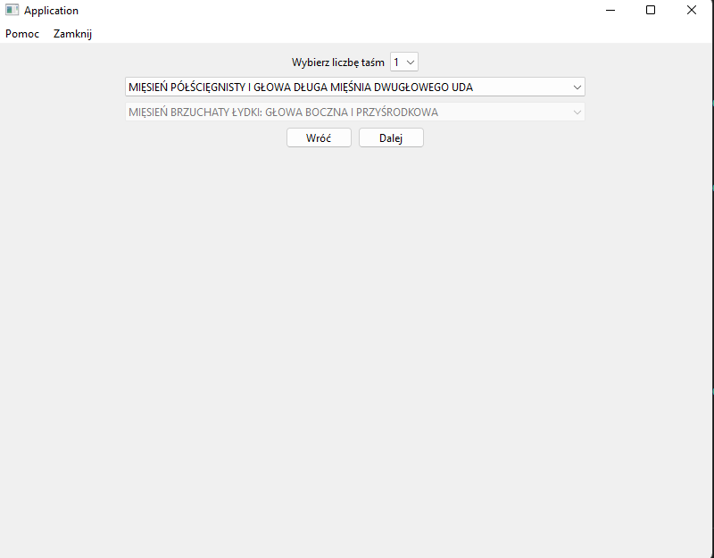

Połaczenie się z taśmami TRYB AUTO
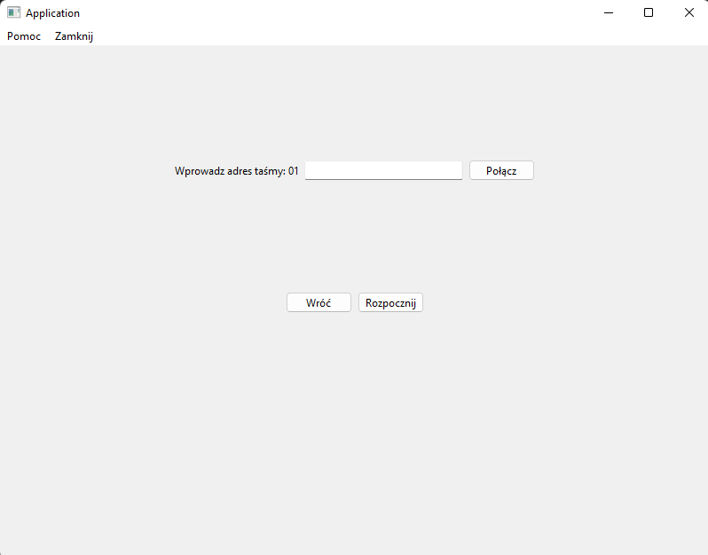

Rozpoczęcie pomiaru referencyjnego
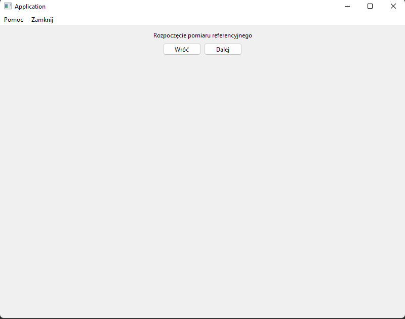

Film video z ćwiczeniem - pomiar referencyjny
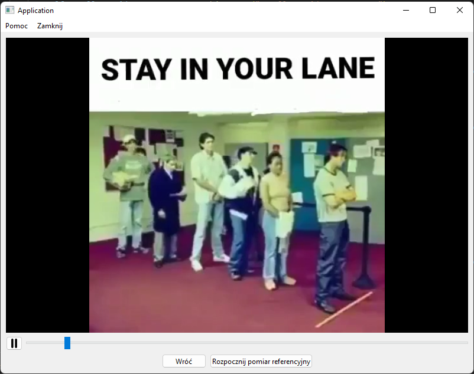

Rozpoczęcie ćwiczenia - pomiar referencyjny
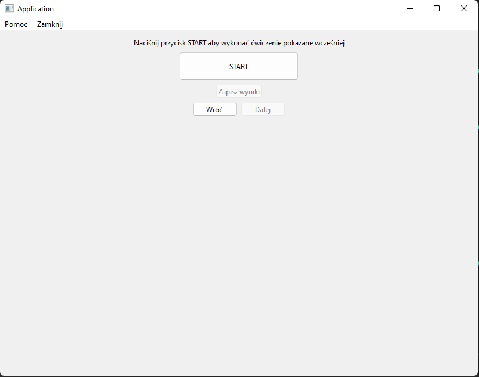

Rozpoczęcie badania
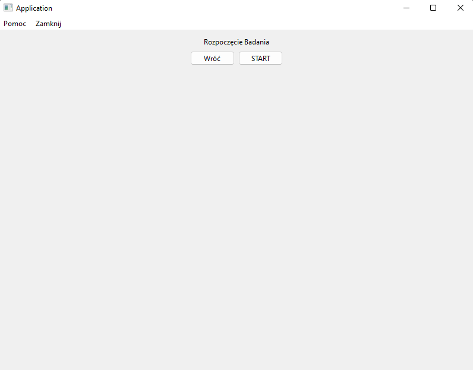

Badanie w trakcie
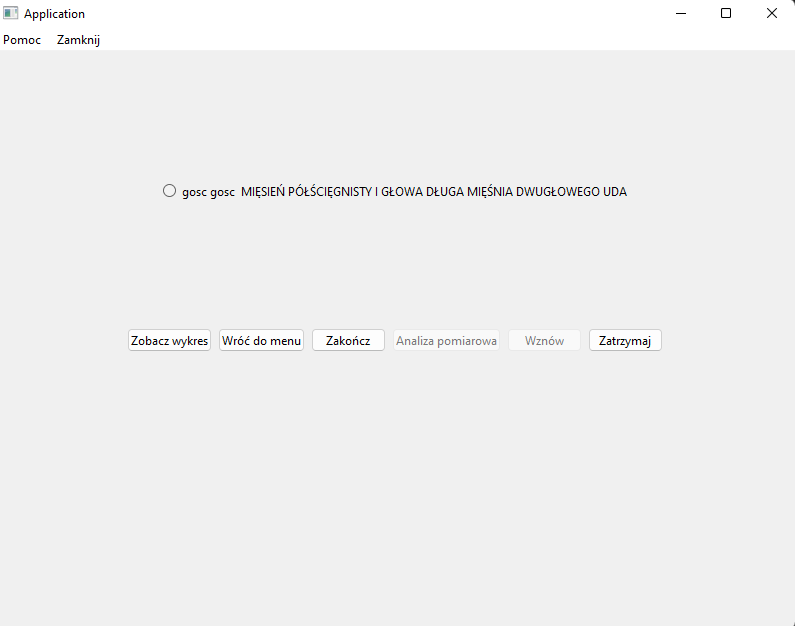

Podgląd wykresu dla wybranej taśmy
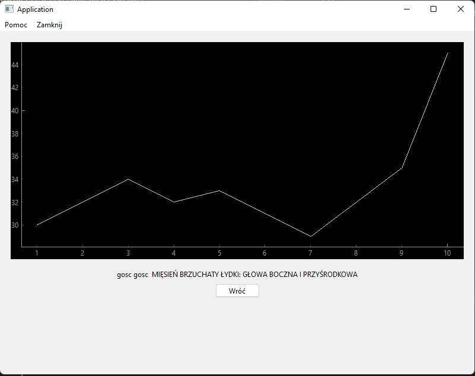

Wybór liczby taśm - TRYB MANUAL

Wybór użytkownika i typu mięśni badanych
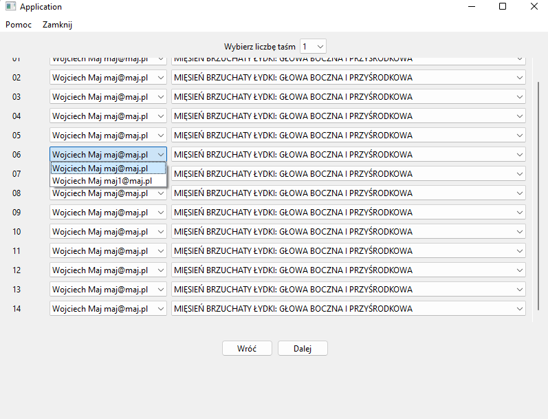

Łączenie się z taśmami  - TRYB MANUAL
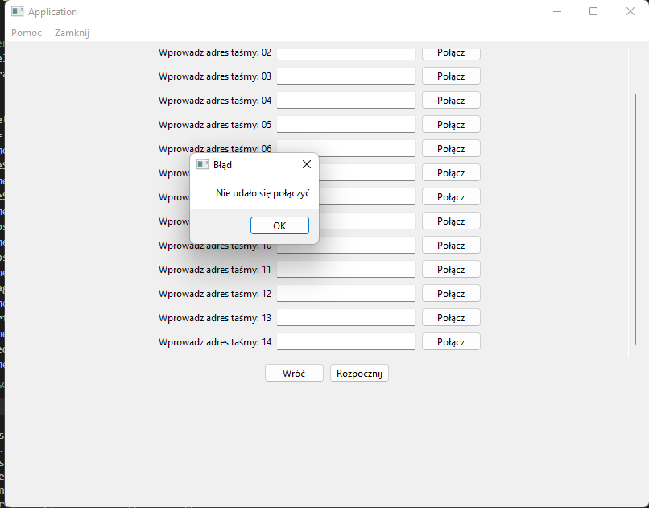

Badanie w trakcie - TRYB MANUAL
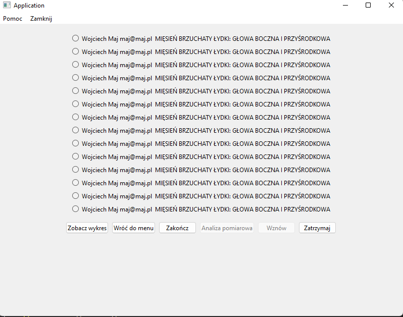
Podgląd wykresu jednej z wybranych taśm
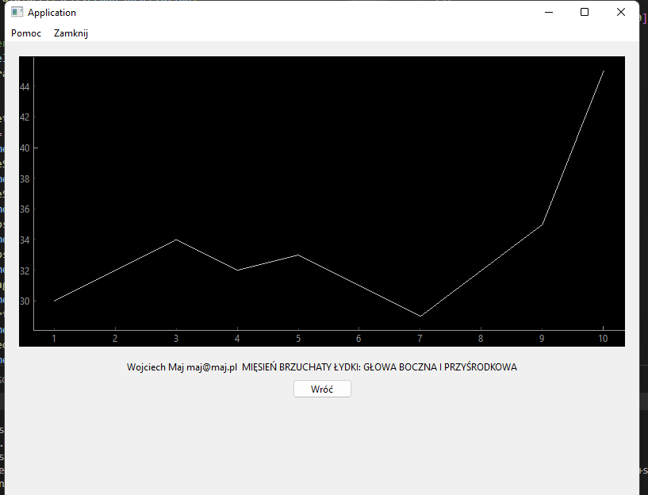

POMOC 
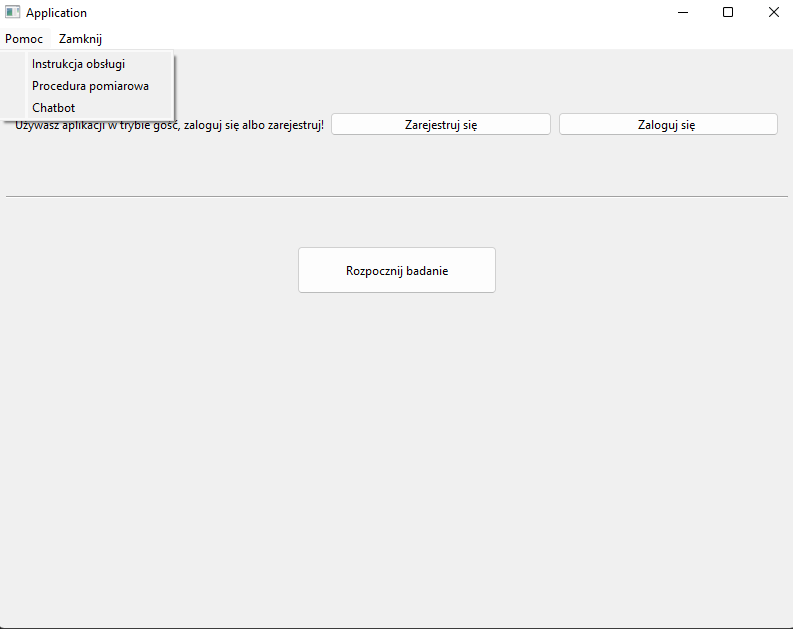

#### Komunikacja

Do komunikacji wykorzystaliśmy protokół `GRPC`, gdzie łączymy się po sieci lan z stacją bazową i przesyłanie wyników następuje za pomocą biblioteki `Protobuf`

Klasa stacji bazowej(serverowa)
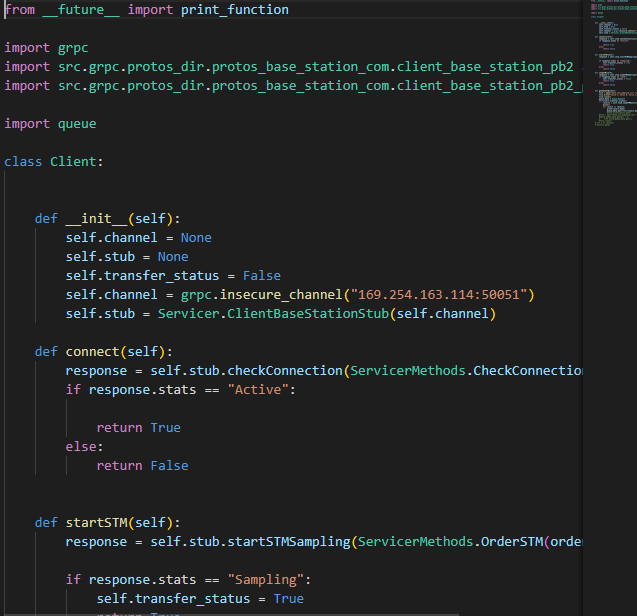

Klasa klienta(komputer diagnosty)
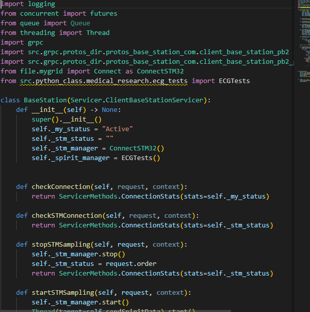

Protobuf wynikowy
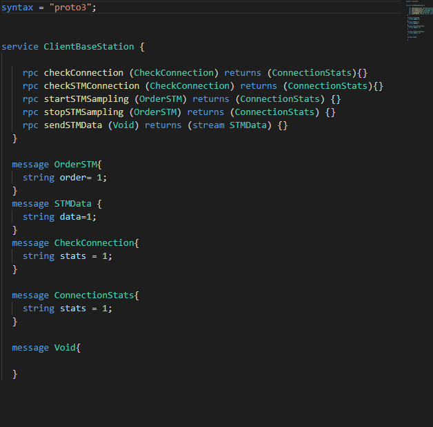

#### Baza danych

Dodatno strukturę tabeli, która bęzie osobna do każego badania pomiarowego
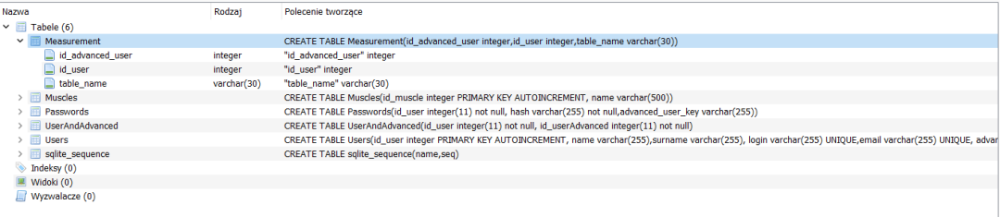
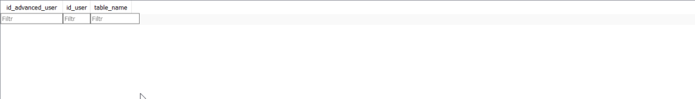
