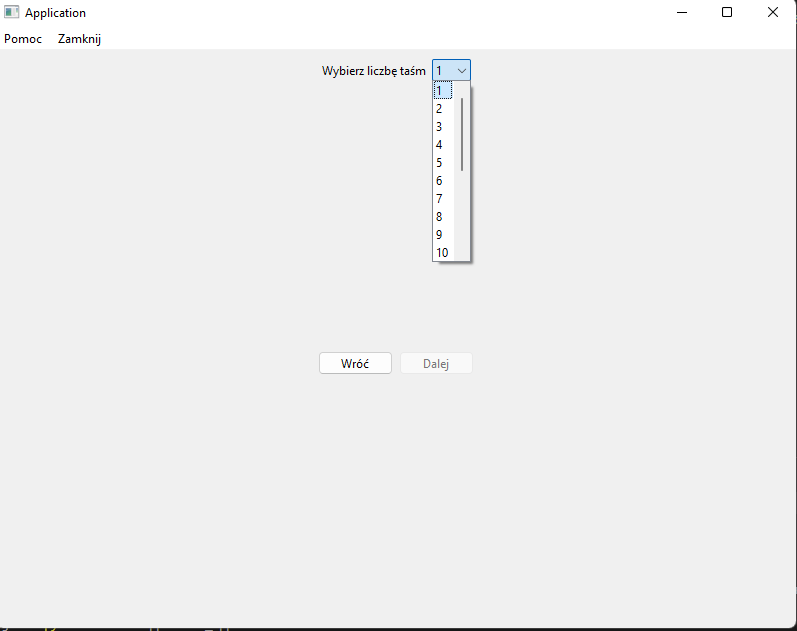

## Raport Etapu 2
#### Niniejszy raport dotyczy podsumowania zrealizowanych zadań z Etapu 2 (Trello-Aplikacja-Etap 2)
> #### Wojciech Maj, Piotr Łach

#### Realizacja

Praca nad stworzeniem aplikacji jest podzielona na 4 etapy. 
Etap 2 miał zostać ukończony do 17 stycznia ( Znaczne przesunięcie), który składa się z następujących zadań:
*  Obsługa bazy danych: dane pomiarowe
*  Widoki trybu Auto
*  Widoki trybu Manual
*  Widoki pomocy
*  Implementacja modułu pomiarowego
*  Implementacja modułu pomocy

Wszystkie zadania udało się zrealizować

#### Problemy

Ten etap był bardzo obfity w pojawianie się problemów, począwszy od tego że długi czas oczekiwania na otrzymanie stacji bazowej i modułu akwizycji danych.
Dodatkowo pojawił się znaczny problem w doborze biblioteki `Kivy`, która nie dość że mocno dołożyła nam pracy to całkowicie się nie sprawdziła na etapie wizualizacji sygnału. 
Dlatego ten czas został wydłużony o ponową implementację całego widoku z wykorzystaniem innej biblioteki `PyQt6`, gdzie musieliśmy ponownie przeprowadzić etap 1, co skutkowało dodatkowym nakładem pracy.

### GUI trybów pomiarowych

Rozpoczęcei pomiaru dla trybu gość

Wybór aktywności

Wybór sylwetki

Wybór liczby taśm pomiarowych TRYB AUTO

Połaczenie się z taśmami TRYB AUTO

Rozpoczęcie pomiaru referencyjnego

Film video z ćwiczeniem - pomiar referencyjny

Rozpoczęcie ćwiczenia - pomiar referencyjny

Rozpoczęcie badania

Badanie w trakcie

Podgląd wykresu dla wybranej taśmy

Wybór liczby taśm - TRYB MANUAL

Wybór użytkownika i typu mięśni badanych

Łączenie się z taśmami  - TRYB MANUAL

Badanie w trakcie - TRYB MANUAL

Podgląd wykresu jednej z wybranych taśm

POMOC 

#### Komunikacja

Do komunikacji wykorzystaliśmy protokół `GRPC`, gdzie łączymy się po sieci `LAN` z stacją bazową i przesyłanie wyników następuje za pomocą biblioteki `Protobuf`

Klasa stacji bazowej(serverowa)

Klasa klienta(komputer diagnosty)

Protobuf wynikowy

#### Baza danych

Dodano strukturę tabeli, która będzie tworzona do każdego badania pomiarowego

