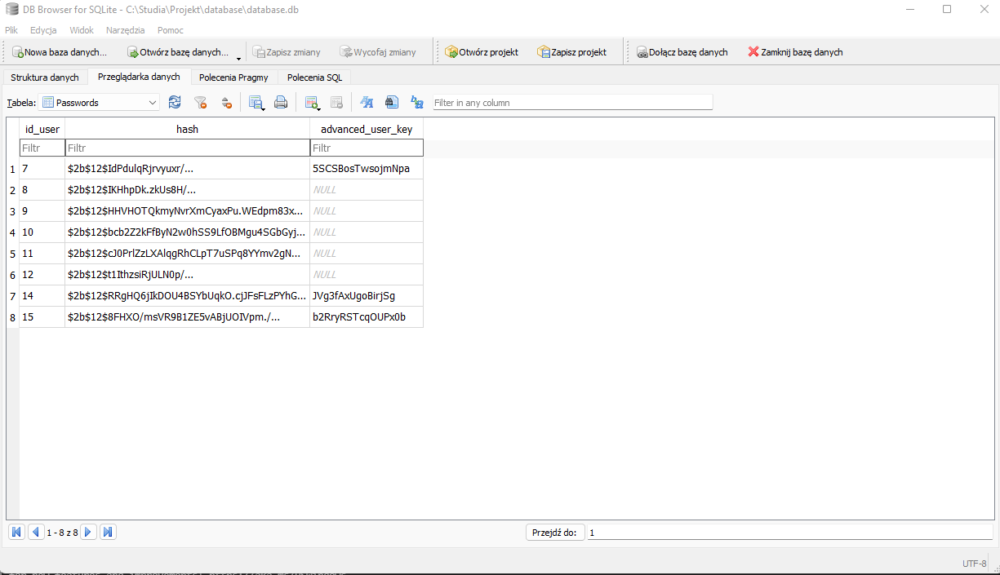
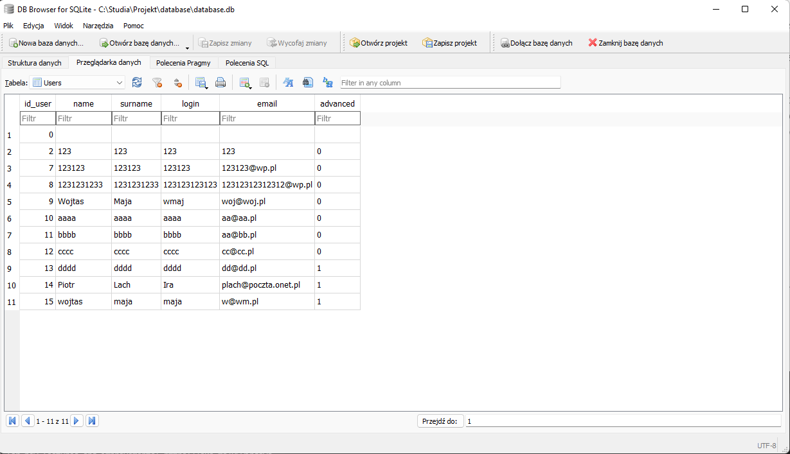
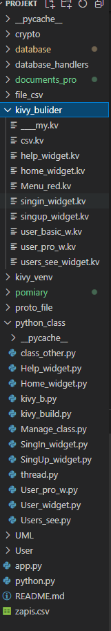
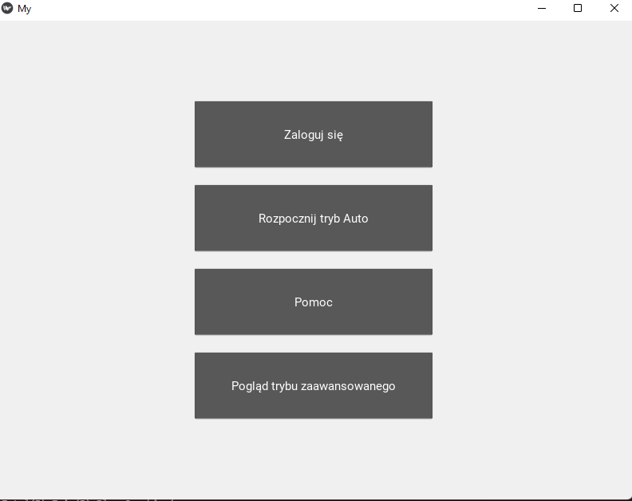
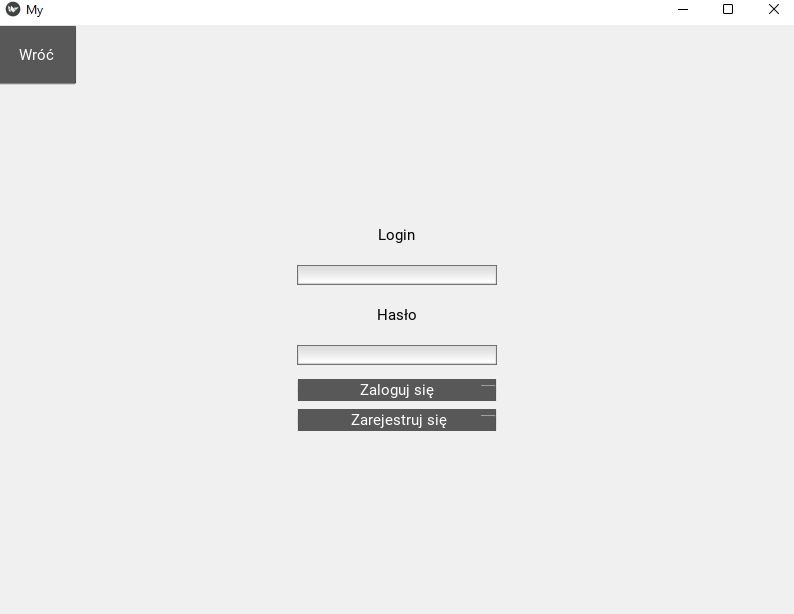
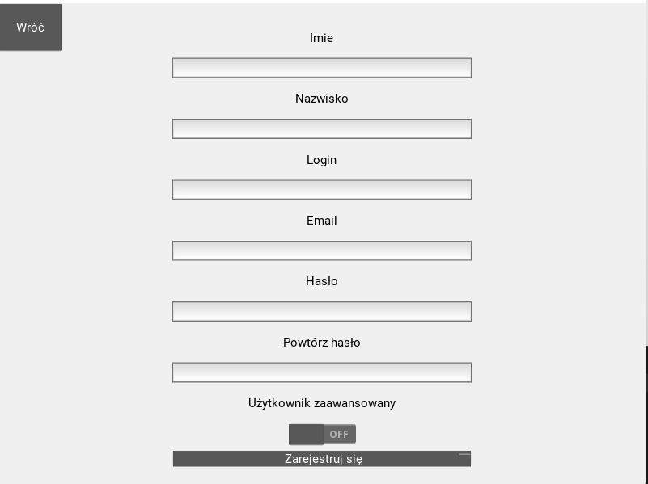
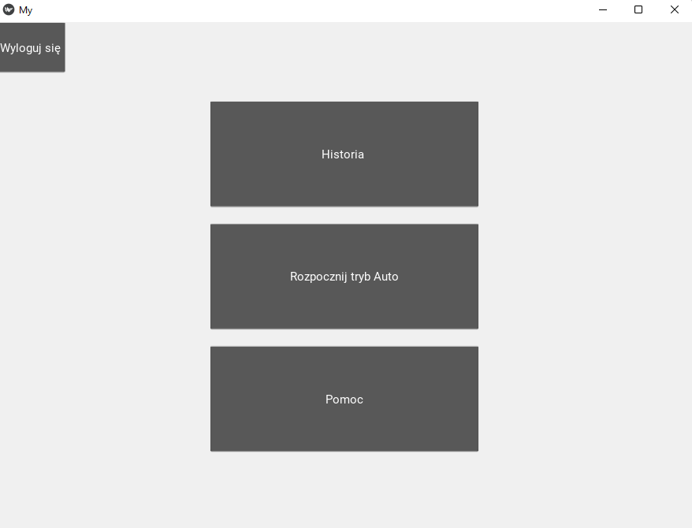
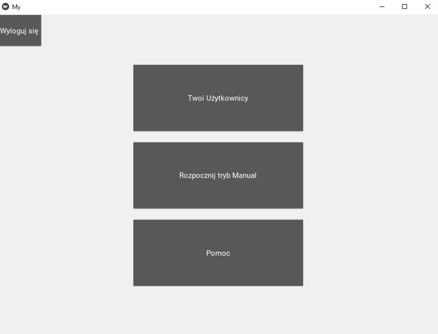
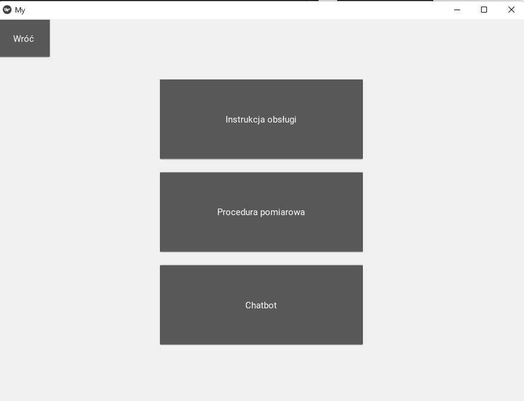
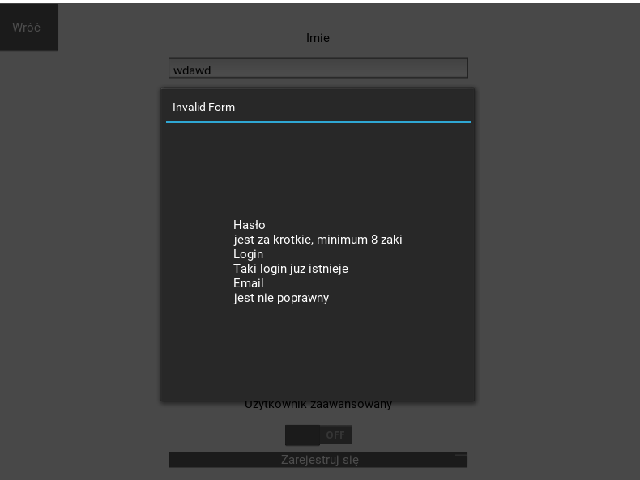

## Raport Etapu 1
#### Niniejszy raport dotyczy podsumowania zrealizowanych zadań z Etapu 1 (Trello-Aplikacja-Etap 1)
> #### Wojciech Maj, Piotr Łach

#### Założenia

Głównych założeń aplikacji jest prowadzenie akwizycji danych podczas sesji treningowych lub rehabilitacyjnych. Dodatkowo aplikacja ma zadanie umożliwić wyświetlenie historii pomiarowej użytkownika lub użytkowników (w przypadku użytkownika zaawansowanego).

#### Realizacja

Praca nad stworzeniem aplikacji jest podzielona na 4 etapy. 
Etap 1 miał zostać ukończony do 22 grudnia, który składa się z następujących zadań:

* Ekran logowania się aplikacji - GUI
* Obsługa bazy danych: logowania - Moduł Bazy danych
* Widok Gościa - GUI
* Widok Użytkownika - GUI
* Widok Użytkownika (wykwalifikowanego) - GUI
* Implementacja modułu gościa z wyłączeniem. badań - Moduł użytkownika
* Implementacja modułu użytkownika z wyłączeniem. badań - Moduł użytkownika
* Implementacja modułu użytkownika (wykwalifikowanego) z wyłączeniem. badań - Moduł * użytkownika

Wszystkie zadania udało się zrealizować.

#### Problemy

W pierwszym etapie prac nad aplikacją nie pojawiło się wiele znaczących problemów, które wpłyneły na znaczne opóźnienie realizacji poszczególnych tasków.
Jednym z największych problemów jakie nas napotkało jest wyświetlenie wszystkich użytkowników podlegających pod użytkownika zaawansowanego.
Niestety Framework jakim jest Kivy posiada dosyć słabo zrozumiałą dokumentacje dotyczącej dynamicznej listy.

Kolejny problem jaki się pojawił wystąpił przy scalaniu wszystkich widgetów w jedną spójną aplikację.
Niestety narzędzie Kivy nie daje możliwości powrotu do wcześniej używanego widoku(screen/widget).
Do rozwiązania tego problemu wielce przydał się fakt odwołaniaę do klasy rodzica, co daje możliwość wykorzystania stosu, który przetrzymuje nazwy używanych wcześniej widoków.

```python

    q1 = queue.LifoQueue()

    def add_screen(self, name):
        self.q1.put(name)

    def last_screen(self):
        return self.q1.get()
```

Jak widać mamy dwie funkcje, które są odpowiedzialne kolejno za dodanie do stosu nazwy a także pobranie nazwy ostatniego używanego ekranu.


Tak wygląda tabela przechowująca hasła użytkowników


Tak wygląda tabela przechowująca dane użytkowników



Tak oto wygląda na tym etapie dorobek class i widoków aplikacji


### Wygldą aplikacji

Widok gościa


Widok logowania


Widok Rejestracji


Widok użytkownika podstawowego


Widok użytkownika zaawansowanego


Widok pomocy


Walidacja błędów (przykładowa)



Przechodzenie pomiędzy równymi ekranami wygląda następująco, wszystkie zmiany widoku następuje z prawej do lewej a powroty do wcześniejszego  ekrany następują odwrotnie.
